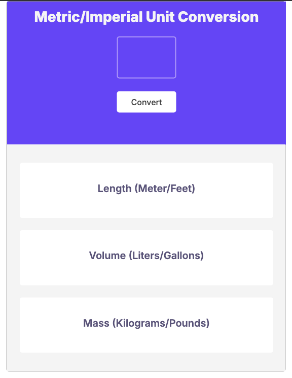

# Unit_Converter_Solo_Project
 A Scrimba.com JavaScript Course Solo-Project Challenge

 

 # Metric/Imperial Unit Converter

A lightweight, user-friendly tool to convert between metric and imperial units. This application provides instant conversion for length, volume, and mass measurements.

## Features

- **Length Conversion**: Convert between meters and feet
- **Volume Conversion**: Convert between liters and gallons
- **Mass Conversion**: Convert between kilograms and pounds
- **Real-time Calculation**: Instantly see conversion results
- **Input Validation**: Error handling for invalid inputs

## How It Works

1. Enter a numeric value in the input field
2. Click the "Convert" button
3. View the conversion results for all three measurement types

## Technical Implementation

### HTML Structure
- Clean, semantic HTML5 markup
- Responsive container layout
- Separate sections for input and results display

### CSS Styling
- Modern, clean interface
- Clear visual hierarchy
- Responsive design principles

### JavaScript Functionality
- DOM manipulation to update conversion results
- Event listeners for button interaction
- Error handling for invalid user inputs
- Precise decimal formatting using `.toFixed()`

### Conversion Formulas
The application uses the following conversion rates:
- 1 meter = 3.281 feet
- 1 liter = 0.264 gallon
- 1 kilogram = 2.204 pounds

## Code Example

```javascript
function convertUnits() {
  let inputValue = Number(inputBox.value);
  
  // Error handling
  if (!inputValue && inputValue !== 0) {
    alert("Enter valid number");
    inputBox.focus();
    return;
  }
  
  // Perform conversions
  metersAndFeet.textContent = `${inputValue} meters = ${(inputValue * metersToFeet).toFixed(3)} feet | ${inputValue} feet = ${(inputValue / metersToFeet).toFixed(3)} meters`;
  
  litersAndGallons.textContent = `${inputValue} liters = ${(inputValue * litersToGallon).toFixed(3)} gallons | ${inputValue} gallons = ${(inputValue / litersToGallon).toFixed(3)} liters`;
  
  kilosAndPounds.textContent = `${inputValue} kilos = ${(inputValue * kilogramToPounds).toFixed(3)} pounds | ${inputValue} pounds = ${(inputValue / kilogramToPounds).toFixed(3)} kilos`;
}
```

## Future Enhancements

- Add more unit conversion types (temperature, area, etc.)
- Include option to copy results to clipboard
- Add visual feedback for conversions
- Implement history of recent conversions

## Installation and Setup

1. Clone the repository:
   ```
   git clone https://github.com/Allen1303/Unit_Converter_Solo_Project
   ```

2. Open `index.html` in your browser of choice

3. No additional dependencies or setup required!

## Browser Compatibility

- Chrome (latest)
- Firefox (latest)
- Safari (latest)
- Edge (latest)

## Acknowledgments

This project was created as part of the JavaScript course from [Scrimba.com](https://scrimba.com).
Special thanks to the Scrimba team for providing the project concept and educational materials.
